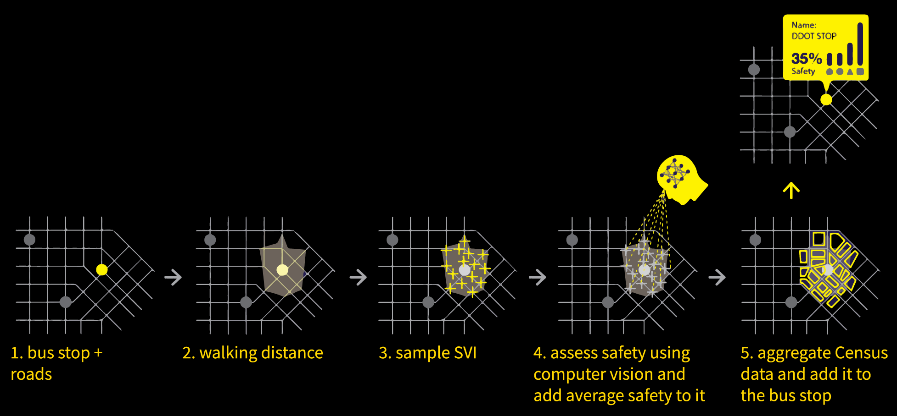

# Mapping Perceived Safety Around Bus Stops In Detroit Using Crowdsourced Street Views

## Background
The concept of social infrastructure takes into account the physical places and organizations that shape the way people interact. The project, "Mapping Perceived Safety Around Bus Stops In Detroit Using Mapillary Street Views," is rooted in the idea that bus stops are not merely transit locations but pivotal social infrastructures that contribute significantly to the urban social fabric. The motivation behind this project is the recognition that the safety of these social spaces is paramount for fostering community interactions and ensuring the well-being of citizens. In Detroit, where the social infrastructure is in a critical phase of redevelopment, ensuring the safety of public spaces is essential for nurturing trust and community spirit.

## Object
This project focuses on the 10-minute-walk-distance areas of bus stops in Detroit. 

## Data
- Street views (Mapillary)
- Bus stop POIs (OSM)
- Road lines (OSM)
- Census data
- PlacePulse2.0

## Method
### Tools
- osmdata (R)
- tidycensus (R)
- fastai/pytorch (Python)
- leaflet JS
### Roadmap

## Interactive map
[view this map](https://billbillbilly.github.io/perceived-safety-around-bus-stops/)
